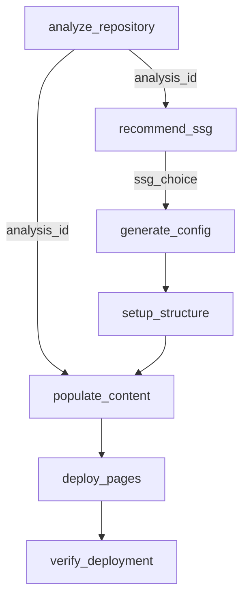

# Architecture Overview

DocuMCP follows a modular, MCP-native architecture designed for intelligent documentation deployment. This document explains the core concepts, design decisions, and architectural patterns that make DocuMCP both powerful and maintainable.

## Introduction

DocuMCP is built on the [Model Context Protocol (MCP)](https://modelcontextprotocol.io/), which enables AI assistants to interact with external tools and data sources through a standardized interface. Understanding this foundation is crucial to grasping how DocuMCP delivers intelligent documentation automation.

## Core Architectural Concepts

### MCP Server Architecture

DocuMCP implements a **stateless MCP server** that exposes 10 specialized tools through the MCP protocol:

```typescript
// Core MCP Server Structure
Server {
  capabilities: {
    tools: {},      // 10 documentation tools
    prompts: {},    // 3 guided workflows  
    resources: {},  // Generated artifacts storage
  }
}
```

**Key Characteristics:**
- **Stateless Operations**: Each tool call is independent and idempotent
- **Protocol Compliance**: Full MCP specification adherence
- **TypeScript Implementation**: Type-safe operations with Zod validation
- **Resource Management**: Automatic storage and retrieval of generated artifacts

### Tool-Based Modular Design

Each DocuMCP tool is a **self-contained module** with defined inputs, outputs, and responsibilities:

```
┌─────────────────────┐    ┌─────────────────────┐    ┌─────────────────────┐
│   Analysis Tools    │    │   Setup Tools       │    │  Deployment Tools   │
├─────────────────────┤    ├─────────────────────┤    ├─────────────────────┤
│ analyze_repository  │    │ generate_config     │    │ deploy_pages        │
│ detect_gaps         │    │ setup_structure     │    │ verify_deployment   │
│ recommend_ssg       │    │ populate_content    │    │ test_local          │
└─────────────────────┘    └─────────────────────┘    └─────────────────────┘
```

### Progressive Complexity Model

DocuMCP supports three levels of user interaction:

1. **Simple Mode**: Single tool calls for specific tasks
2. **Workflow Mode**: Guided prompts for common scenarios  
3. **Advanced Mode**: Custom tool sequencing and integration

## Design Decisions

### Why MCP Protocol?

We chose MCP as the foundation for several strategic reasons:

**✅ Advantages:**
- **AI-Native Integration**: Seamless interaction with AI assistants
- **Standardized Interface**: Consistent tool calling across different AI clients
- **Future-Proof**: Protocol designed for evolving AI capabilities
- **Composability**: Tools can be combined into complex workflows

**⚠️ Trade-offs:**
- **Learning Curve**: Requires understanding of MCP concepts
- **Client Dependency**: Requires MCP-compatible AI client
- **Protocol Overhead**: More complex than simple CLI tools

### Stateless vs Stateful Architecture

**Decision**: Stateless MCP server with optional resource caching

**Rationale:**
```typescript
// Stateless tool execution
export async function analyzeTool(args: ToolArgs): Promise<ToolResult> {
  // No persistent state - all context in args
  const result = await processInput(args);
  
  // Optional resource storage for reuse
  storeResource(`analysis-${timestamp}`, result);
  
  return result;
}
```

**Benefits:**
- **Reliability**: No state corruption or memory leaks
- **Scalability**: Easy horizontal scaling
- **Debugging**: Deterministic tool behavior
- **Consistency**: Same inputs always produce same outputs

**Costs:**
- **Resource Usage**: May recompute expensive operations
- **Integration Complexity**: Must pass context between tools

### TypeScript + Zod Validation

**Decision**: TypeScript implementation with Zod schema validation

**Architecture Impact:**
```typescript
// Type-safe tool definition
const ToolSchema = z.object({
  path: z.string().describe('Repository path'),
  depth: z.enum(['quick', 'standard', 'deep']).default('standard'),
});

type ToolArgs = z.infer<typeof ToolSchema>;

export async function tool(args: unknown): Promise<ToolResult> {
  // Runtime validation + compile-time types
  const validatedArgs = ToolSchema.parse(args);
  // ... implementation
}
```

**Benefits:**
- **Type Safety**: Compile-time error detection
- **Runtime Validation**: Prevents invalid inputs
- **Auto-Documentation**: Schema serves as API documentation
- **IDE Support**: Excellent autocomplete and refactoring

## System Architecture Layers

### 1. Protocol Layer (MCP Interface)

```typescript
// MCP protocol handling
server.setRequestHandler(CallToolRequestSchema, async (request) => {
  const { name, arguments: args } = request.params;
  
  // Route to appropriate tool
  const result = await toolHandlers[name](args);
  return formatMCPResponse(result);
});
```

**Responsibilities:**
- MCP protocol compliance
- Request/response formatting
- Error handling and propagation
- Client communication management

### 2. Tool Orchestration Layer

```typescript
// Tool registration and dispatch
const TOOLS = [
  { name: 'analyze_repository', handler: analyzeRepository },
  { name: 'recommend_ssg', handler: recommendSSG },
  // ... other tools
];

// Dynamic tool routing
async function dispatchTool(name: string, args: unknown) {
  const tool = TOOLS.find(t => t.name === name);
  if (!tool) throw new ToolNotFoundError(name);
  
  return await tool.handler(args);
}
```

**Responsibilities:**
- Tool discovery and registration
- Input validation and sanitization
- Output formatting and standardization
- Cross-tool data flow management

### 3. Business Logic Layer

```typescript
// Domain-specific implementation
export async function analyzeRepository(args: AnalysisArgs): Promise<AnalysisResult> {
  // File system analysis
  const structure = await analyzeFileStructure(args.path);
  
  // Dependency analysis  
  const dependencies = await analyzeDependencies(args.path);
  
  // Documentation assessment
  const docs = await assessDocumentation(args.path);
  
  return {
    id: generateAnalysisId(),
    structure,
    dependencies,
    documentation: docs,
    recommendations: generateRecommendations(structure, dependencies, docs),
  };
}
```

**Responsibilities:**
- Core documentation intelligence
- File system operations
- Content analysis and generation
- Recommendation algorithms

### 4. Infrastructure Layer

```typescript
// Resource management and storage
class ResourceManager {
  private store = new Map<string, StoredResource>();
  
  store(uri: string, content: string, mimeType: string): void {
    this.store.set(uri, { content, mimeType, timestamp: Date.now() });
  }
  
  retrieve(uri: string): StoredResource | undefined {
    return this.store.get(uri);
  }
}
```

**Responsibilities:**
- Resource storage and retrieval
- File system abstraction
- Network communication
- Error handling and logging

## Data Flow Architecture

### Analysis-Driven Workflow



**Key Patterns:**
- **Analysis First**: Repository analysis drives all subsequent decisions
- **ID-Based Linking**: Analysis IDs connect related operations
- **Progressive Enhancement**: Each step builds on previous results
- **Validation Gates**: Each tool validates its prerequisites

### Resource Storage Pattern

```typescript
// Consistent resource storage across tools
function storeToolResult(toolName: string, result: any): string {
  const resourceId = `${toolName}-${Date.now()}`;
  const uri = `documcp://${toolName}/${resourceId}`;
  
  storeResource(uri, JSON.stringify(result, null, 2), 'application/json');
  return resourceId;
}
```

## Comparison with Alternative Approaches

| Architecture | DocuMCP Approach | Traditional CLI | Web Service API |
|--------------|------------------|-----------------|-----------------|
| **Integration** | MCP protocol | Shell scripts | HTTP endpoints |
| **AI Interaction** | Native support | Manual scripting | API calls |
| **State Management** | Stateless + resources | File-based | Database |
| **Type Safety** | TypeScript + Zod | Minimal | Varies |
| **Extensibility** | MCP tool addition | Script composition | Endpoint addition |
| **Deployment** | Client-managed | System installation | Server deployment |

### Why Not a Traditional CLI?

**CLI Limitations:**
- Manual workflow orchestration
- No AI-native integration
- Complex parameter passing
- Limited composability

**MCP Advantages:**
- AI assistant handles orchestration
- Natural language interaction
- Automatic parameter validation
- Seamless tool composition

### Why Not a Web Service?

**Web Service Complexity:**
- Server deployment and maintenance
- Authentication and authorization
- Network reliability concerns
- Scaling and load management

**MCP Benefits:**
- Client-side execution
- No server infrastructure
- Direct file system access
- Simplified deployment

## Performance Considerations

### Tool Execution Optimization

```typescript
// Efficient file system operations
async function analyzeFileStructure(path: string): Promise<FileStructure> {
  // Parallel directory traversal
  const [files, packages, configs] = await Promise.all([
    glob('**/*', { cwd: path, ignore: ['node_modules/**'] }),
    findPackageFiles(path),
    findConfigFiles(path),
  ]);
  
  return { files, packages, configs };
}
```

### Memory Management

```typescript
// Streaming for large repositories
async function* traverseFiles(path: string): AsyncGenerator<FileInfo> {
  for await (const entry of walk(path)) {
    if (!shouldIgnore(entry.path)) {
      yield await analyzeFile(entry);
    }
  }
}
```

## Security Architecture

### Path Validation

```typescript
// Prevent directory traversal attacks
function validatePath(inputPath: string): string {
  const resolved = path.resolve(inputPath);
  const normalized = path.normalize(resolved);
  
  // Ensure path doesn't escape intended boundaries
  if (!normalized.startsWith(process.cwd())) {
    throw new SecurityError('Invalid path: outside working directory');
  }
  
  return normalized;
}
```

### Input Sanitization

```typescript
// Zod-based input validation
const PathSchema = z.string()
  .min(1, 'Path required')
  .refine(path => !path.includes('..'), 'Path traversal not allowed')
  .refine(path => path.length < 1000, 'Path too long');
```

## Future Architecture Evolution

### Planned Extensions

1. **Plugin System**: Dynamic tool loading
2. **Workflow Engine**: Complex multi-tool orchestration
3. **Caching Layer**: Intelligent result caching
4. **Distributed Execution**: Remote tool execution

### MCP Protocol Evolution

DocuMCP's architecture is designed to evolve with the MCP specification:

- **Backward Compatibility**: Versioned tool interfaces
- **Protocol Extensions**: Ready for new MCP capabilities
- **Client Adaptability**: Works with emerging MCP clients

## Further Reading

- [MCP Tools Development Guide](../how-to/how-to-add-a-new-feature.md)
- [Design Decisions](./design-decisions.md)
- [Technology Stack](./technology-stack.md)
- [Model Context Protocol Specification](https://modelcontextprotocol.io/)